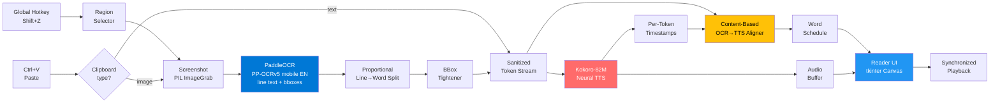

<div align="center">

# SelectAndRead

### Drag a box on your screen — or paste from your clipboard. Hear it read aloud, with each word highlighted as it's spoken.

A desktop OCR + neural-TTS pipeline with synchronized word highlighting, frame-accurate scrubbing, perceptually-optimized highlight colors, WAV export, and proper Windows taskbar integration. Pure Python, runs 100% locally, no cloud.

[](https://python.org)
[](https://pytorch.org)
[](https://huggingface.co/hexgrad/Kokoro-82M)
[](https://github.com/PaddlePaddle/PaddleOCR)
[](#)
[](#license)
[](#)

**[Quick Start](#quick-start) · [Features](#features) · [How It Works](#how-it-works) · [Troubleshooting](#troubleshooting)**

</div>

---

## Why SelectAndRead

Most TTS tools only handle copy-paste. That's fine for a Word doc — useless for a PDF figure caption, a UI screenshot, a YouTube subtitle, a cropped journal page, or anything where the text isn't selectable. SelectAndRead works on **anything you can see on your screen** — and still accepts pasted text or images when that's faster.

**Built for:**
- 📄 **Reading PDFs and papers** — including scanned ones where text isn't selectable
- ♿ **Accessibility** — low-vision users, dyslexia support, eye strain relief
- 🌍 **Language learners** — hear native pronunciation of any English text on the screen
- 💻 **Developers** — hands-free reading of long documentation or error logs
- 🧠 **Multitasking** — turn anything visible into a podcast in two seconds

Everything runs **100% locally**. No accounts, no API keys, no text leaves your machine.

---

## How It Works

**Drag a region** (`Shift+Z`):
```
1.  Press the global hotkey                from anywhere on the desktop
2.  Drag a rectangle                       across the region you want read
3.  PaddleOCR (PP-OCRv5 mobile EN) reads   the text + bounding boxes
4.  Kokoro-82M generates speech            with word-level timestamps
5.  A reader window opens                  highlighting each word as it's spoken
```

**Paste anything** (`Ctrl+V` or the Paste button):
```
1.  Copy text or a screenshot              from any application
2.  Paste — text bypasses OCR entirely;    images go through the pipeline above
3.  Reader opens immediately
```

The reader gives you a full timeline scrubber, ±5s skip, 0.5×–2.0× speed, pause/resume, and a one-click WAV export.

---

## Quick Start

1. **Install Python 3.10, 3.11, or 3.12** from [python.org](https://python.org) — make sure to tick **"Add Python to PATH"** during install.
   > ⚠️ Python 3.13+ is not supported yet.
2. **Download this repo** — click **Code → Download ZIP** on GitHub, extract it anywhere.
3. **Double-click `setup.bat`**.
   - It will ask **"Use GPU? (Y/N)"** — answer **Y** only if you have an NVIDIA GPU. The GPU option accelerates **TTS only**; OCR always runs on the CPU.
   - It installs all packages and downloads the AI models (~400 MB, a few minutes).
4. **Launch the app** by double-clicking `SelectAndRead.exe` (or `run.bat` as a fallback).
5. **(Optional) Desktop shortcut** — double-click `create_shortcut.bat` to create a pinnable Desktop / taskbar shortcut.

That's it. Press **`Shift+Z`** anywhere on your desktop and drag a box.

---

## Features

### Input methods
- **Drag a screen region** with the global hotkey (works on PDFs, videos, photos, anything visible)
- **Paste from clipboard** — `Ctrl+V` reads either an image (full OCR pipeline) or text (OCR is skipped entirely)
- **PaddleOCR (PP-OCRv5 mobile EN)** — small, fast, high-accuracy deep-learning OCR. Mobile-variant models total under ~20 MB and run on CPU comfortably.

### Reading experience
- **Word-by-word highlighting** synchronized to audio via Kokoro's per-token timestamps
- **Frame-accurate timeline scrubber** — instant seek to any position, no thumb-drag lag
- **Speed control** 0.5× to 2.0× with **no pitch shift and no model re-run** (samplerate trick)
- **Skip ±5s** via on-screen buttons or arrow keys
- **Pause/resume** via Space or a global hotkey from anywhere
- **Text view mode** — render OCR text on a clean background instead of the original screenshot

### Visual quality
- **Auto highlight color** — picks the most perceptually salient highlight for the detected background and text colors using WCAG contrast ratios and opponent-channel color science
- **Custom highlight color picker** if you want to override
- **Tight word highlights** — covers only the letters, never the surrounding whitespace

### Voices and audio
- **24 English voices** — American/British, male/female (Kokoro voice pack)
- **WAV export** — 16-bit, 24 kHz, ready for podcast feeds or Audacity
- **GPU acceleration** for the TTS model (toggle from the UI, requires CUDA)

<details>
<summary><b>Full voice list (click to expand)</b></summary>

| American Female | American Male | British Female | British Male |
|---|---|---|---|
| Heart, Sky, Bella, Nova, River, Sarah, Nicole, Aoede, Kore, Jessica | Michael, Adam, Echo, Eric, Liam, Onyx, Puck | Emma, Isabella, Alice, Lily | George, Lewis, Daniel |

</details>

### Native Windows integration
- **Real `.exe` launcher** built from `_launcher.cs` during setup — proper taskbar icon, no console window, animated splash while models warm up
- **Pinnable to taskbar** — the desktop shortcut and the running app share an `AppUserModelID`, so a single button works as both launcher and active-window indicator
- **Animated splash screen** — gold/orange spinning ring with the app icon, transparent background, closes the moment the app window is ready (file-based handshake — no flaky window-title sniffing)
- **DPI-aware** — works correctly on multi-monitor and high-DPI setups

### Quality of life
- **Global hotkeys** — fully reassignable from the settings dialog with live key capture
- **Persistent settings** — voice, hotkeys, GPU mode, highlight preferences saved to `~/.tts_reader.json`

---

## Architecture



The core insight is that **OCR words and TTS words don't always align 1:1** — Kokoro occasionally defers tokens (especially around special characters like ®, ©, ™) to a later segment. The aligner solves this by matching on normalized text content rather than on position, with a sequential cursor as a graceful fallback.

---

## Under the Hood

**PaddleOCR PP-OCRv5 mobile**
Recognition uses PaddleOCR's PP-OCRv5 *mobile* English models — the lightweight (~20 MB total) variant of the v5 release. Detection produces axis-aligned line bboxes; recognition reads each line. The `_paddle_ocr` helper wraps `PaddleOCR.predict()` and returns per-word entries by splitting each line bbox proportionally by character count.

**Per-pixel bounding box tightening**
After the proportional word split, each bbox is shrunk to the columns that actually contain ink by analyzing per-column pixel brightness variance — so highlights cover only the word, never the trailing space.

**Content-based word alignment**
TTS segments don't always map 1:1 to OCR words (Kokoro sometimes defers words like "from" near special characters to a later segment). Alignment is done by normalised text content rather than position, with a sequential cursor as fallback — so every word gets highlighted at its true audio timestamp.

**WCAG contrast + opponent-channel color science**
The auto highlight color sweeps 120 hues × 46 lightness levels, scoring each candidate by chroma × luminance proximity to the background, subject to a minimum 4.5:1 WCAG AA contrast ratio against the text color. This is why fluorescent yellow is the default on white backgrounds — maximum chroma at near-white luminance, firing the blue-yellow opponent channel at peak salience.

**Samplerate speed control**
Speed is applied by passing `samplerate=int(24000 * speed)` to `sounddevice.play()` — the same audio samples play faster or slower without pitch artifacts and without re-running the TTS model.

**Instant seek**
The timeline scrubber suppresses tkinter's built-in Scale widget behavior entirely (`return "break"` on press, drag, and release), computing position directly from cursor x-coordinate as a fraction of the widget width. This gives frame-accurate instant seeks instead of the widget's incremental thumb movement.

**Native launcher with AppUserModelID**
A minimal C# launcher (`_launcher.cs`) is compiled to `SelectAndRead.exe` during setup using the .NET Framework `csc.exe` that ships with every Windows install — no PyInstaller, no extra build dependencies. The launcher embeds `icon.ico`, calls `SetCurrentProcessExplicitAppUserModelID("SelectAndRead.App")` before spawning Python, and shows the splash. `main.py` sets the same AUMID via ctypes when it starts, and `create_shortcut.ps1` stamps the same AUMID onto the `.lnk` file via `IShellLink + IPropertyStore`. With all three matching, Windows treats the pinned shortcut and the running app as the same identity — one taskbar button, no duplicates.

**File-based splash handshake**
The splash polls for `%TEMP%\SelectAndRead.ready`, which `main.py` writes via `root.after(50, ...)` once the Tk window has actually painted. Cross-process Win32 window-text APIs are flaky for tkinter windows; a tiny file is bulletproof.

---

## Tech Stack

| Layer | Library | What it does here |
|---|---|---|
| **Neural TTS** | [Kokoro-82M](https://huggingface.co/hexgrad/Kokoro-82M) | 82M-parameter open-weights TTS model with per-token timestamps |
| **OCR** | [PaddleOCR](https://github.com/PaddlePaddle/PaddleOCR) (PP-OCRv5 mobile EN) | Lightweight high-accuracy OCR — runs on [PaddlePaddle](https://www.paddlepaddle.org.cn/), CPU-friendly |
| **Inference runtime** | [PyTorch](https://pytorch.org) | GPU/CPU backend for both OCR and TTS models |
| **Image processing** | [Pillow (PIL)](https://python-pillow.org) | Screenshot capture, alpha-composited highlight overlays, font rendering |
| **Audio playback** | [sounddevice](https://python-sounddevice.readthedocs.io) | Low-latency PortAudio bindings, samplerate-based speed control |
| **Hotkeys** | [keyboard](https://github.com/boppreh/keyboard) | System-wide hotkey hooks and live capture for the settings dialog |
| **Numerics** | [NumPy](https://numpy.org) | Audio array ops, per-column pixel analysis, color math |
| **GUI** | [tkinter](https://docs.python.org/3/library/tkinter.html) | Main panel, reader window, settings dialogs (stdlib only — no PyQt) |
| **Launcher** | C# / .NET Framework 4 | `SelectAndRead.exe` — embedded icon, splash, sets `AppUserModelID`, spawns Python. Built at install time by the `csc.exe` that ships with every Windows. |

---

## Project Structure

```
SelectAndRead/
├── main.py                  # Entire Python app (single-file)
├── requirements.txt         # Python dependencies
├── setup.bat                # First-time setup: venv, packages, model + voice downloads, builds SelectAndRead.exe
├── _download_models.py      # Helper: pre-fetches OCR + TTS models + all 24 voices
├── _launcher.cs             # Source for SelectAndRead.exe — splash + AUMID + Python spawn
├── SelectAndRead.exe        # Built by setup.bat (gitignored) — preferred launcher
├── run.bat                  # Launches SelectAndRead.exe if present, else _launch.vbs fallback
├── _launch.vbs              # Hidden-window VBS fallback launcher
├── debug.bat                # Launcher with console attached for stack traces
├── create_shortcut.bat      # One-click Desktop shortcut creator
├── create_shortcut.ps1      # PowerShell shortcut builder (stamps AUMID via COM)
├── icon.ico                 # App icon (embedded in .exe, on .lnk, and on the tkinter window)
└── README.md
```

User settings live at `~/.tts_reader.json`.

---

## Hotkeys & Configuration

| Action | Default | Scope |
|---|---|---|
| Select & Read | `Shift+Z` | Global (anywhere on desktop) |
| Pause / Resume | `Shift+X` | Global |
| Paste & Read | `Ctrl+V` | Main panel (focus on app) |
| Skip forward 5s | `→` | Reader window |
| Skip backward 5s | `←` | Reader window |
| Pause / Resume | `Space` | Reader window |

The two **global** hotkeys are remappable from the **⚙ Settings** dialog with live key-combination capture.

---

## Troubleshooting

<details>
<summary><b>"Python not found" / "ERROR: Python … is not supported"</b></summary>

Install Python **3.10, 3.11, or 3.12** from [python.org](https://python.org) and tick **"Add Python to PATH"** during install. Python 3.13+ is not yet supported (Kokoro's deps lag behind). After installing, close the terminal and run `setup.bat` again.

</details>

<details>
<summary><b>"Hotkey '…' is unavailable" in the status bar</b></summary>

Another running app has already claimed `Shift+Z` (or whichever combo). Open **⚙ Settings**, click **Change** next to the hotkey, and bind a different one. Common offenders: screenshot tools, screen-recording overlays, gaming launchers.

</details>

<details>
<summary><b>The Shift+Z hotkey stops working after the app has been open for a while</b></summary>

Windows can silently drop low-level keyboard hooks (LowLevelHooksTimeout, screen-lock, fast-user-switch). The app self-heals: a watchdog probes the hook every 30 s and re-registers it when it looks dead, plus a forced refresh every 5 min as a safety net. You shouldn't need to do anything, but if you ever notice a longer outage, click anywhere on the **SelectAndRead** window — the next watchdog tick will fix it.

</details>

<details>
<summary><b>"Settings file was corrupt" popup on launch</b></summary>

The settings file (`~/.tts_reader.json`) was unreadable — usually after a power-loss or crash mid-save. The app automatically renamed the broken file to `~/.tts_reader.json.broken` so you can inspect it, then reset to defaults. Just reconfigure your voice/highlight and the file will be re-created cleanly (with atomic writes, so this shouldn't recur).

</details>

<details>
<summary><b>GPU mode crashes / "WinError 126" / "c10_cuda.dll not found"</b></summary>

You picked **Y** for GPU during `setup.bat`, but your machine doesn't have a working CUDA installation. Re-run `setup.bat` and pick **N** (CPU). CPU is plenty fast for the TTS model on any modern desktop. (OCR always runs on CPU regardless of this choice.)

</details>

<details>
<summary><b>OCR returned no text / "No text detected"</b></summary>

PaddleOCR works best on clean, dark-on-light printed text. Tips:
- Drag a tighter box around just the text — large regions with lots of background can confuse detection.
- If the text is very small or low-contrast, zoom in first (browser zoom, PDF zoom) and re-drag.
- For images that already are screenshots, use **Ctrl+V** (paste image) — same pipeline, but easier to retry.
- For tiny GIFs/icons with stylised fonts, OCR will simply fail — copy the text manually and paste it with **Ctrl+V** to skip OCR entirely.

</details>

<details>
<summary><b>Want to see the full error / Python traceback</b></summary>

Run `debug.bat` instead of `run.bat` — it launches the app in a console window so you can see stack traces from OCR / TTS errors. Useful when reporting an issue.

</details>

---

## License

**MIT** — do whatever you want, attribution appreciated.

---

## Acknowledgments

- **[Kokoro-82M](https://huggingface.co/hexgrad/Kokoro-82M)** by hexgrad — remarkable TTS quality at this parameter count
- **[PaddleOCR](https://github.com/PaddlePaddle/PaddleOCR)** by the PaddlePaddle team — PP-OCRv5 mobile models, excellent accuracy at small size
- WCAG color-contrast formulas from the W3C Accessibility Guidelines
