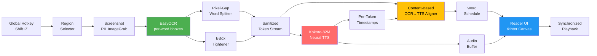

<div align="center">

# SelectAndRead

### Drag a box on your screen. Hear it read aloud — with the words highlighted as they're spoken.

A desktop OCR + neural-TTS pipeline with synchronized word highlighting, frame-accurate scrubbing, perceptually-optimized auto-highlight colors, and audio export. Pure Python, runs locally, no cloud.

[](https://python.org)
[](https://pytorch.org)
[](https://huggingface.co/hexgrad/Kokoro-82M)
[](https://github.com/JaidedAI/EasyOCR)
[](#)
[](#license)
[](#)

</div>

---

## Why SelectAndRead

Most TTS tools want you to copy-paste text. That's fine for a Word doc — useless for a PDF figure caption, a UI screenshot, a YouTube subtitle, a cropped journal page, or anything else where the text isn't selectable. SelectAndRead works on **anything you can see on your screen.**

**Built for:**
- 📄 **Reading PDFs and papers** — including scanned ones where text isn't selectable
- ♿ **Accessibility** — low-vision users, dyslexia support, eye strain relief
- 🌍 **Language learners** — hear native pronunciation of any English text on the screen
- 💻 **Developers** — hands-free reading of long documentation or error logs
- 🧠 **Multitasking** — turn anything visible into a podcast in two seconds

Everything runs **100% locally**. No accounts, no API keys, no text leaves your machine.

---

## How It Works

```
1.  Press global hotkey (Shift+Z)         from anywhere on the desktop
2.  Drag a rectangle                       across the region you want read
3.  EasyOCR extracts text + per-word boxes from the screenshot
4.  Kokoro-82M generates speech            with word-level timestamps
5.  A reader window opens                  highlighting each word as it's spoken
```

The reader gives you a full timeline scrubber, ±5s skip, 0.5×–2.0× speed, pause/resume, and a one-click WAV export.

---

## Installation

1. Install **Python 3.12** from [python.org](https://python.org) — tick **"Add Python to PATH"** during install
   > ⚠️ Python 3.13+ is not supported. Use Python 3.10, 3.11, or 3.12.
2. Download this repo — click **Code → Download ZIP** on GitHub, extract it anywhere
3. Double-click **`setup.bat`**
   - It will ask: **"Use GPU? (Y/N)"** — if you have an NVIDIA GPU say Y, otherwise N
   - It installs all packages and downloads the AI models (~400 MB, takes a few minutes)
4. Double-click **`run.bat`** to launch

**Optional — Desktop shortcut:** double-click **`create_shortcut.bat`** to add a SelectAndRead shortcut to your Desktop.

---

## Features

### Reading experience
- **Word-by-word highlighting** synchronized to audio via Kokoro's per-token timestamps
- **Frame-accurate timeline scrubber** — instant seek to any position, no thumb-drag lag
- **Speed control** 0.5× to 2.0× with **no pitch shift and no model re-run** (samplerate trick)
- **Skip ±5s** via on-screen buttons or arrow keys
- **Pause/resume** via Space or a global hotkey from anywhere
- **Text view mode** — render OCR text on a clean background instead of the original screenshot

### Visual quality
- **Auto highlight color** — picks the most perceptually salient highlight for the detected background and text colors using WCAG contrast ratios and opponent-channel color science
- **Custom highlight color picker** if you want to override
- **Tight word highlights** — covers only the letters, never the surrounding whitespace

### Voices and audio
- **24 English voices** — American/British, male/female (Kokoro voice pack)
- **WAV export** — 16-bit, 24 kHz, ready for podcast feeds or Audacity
- **GPU acceleration** for both OCR and TTS (toggle from the UI, requires CUDA)

### Quality of life
- **Global hotkeys** — fully reassignable from the settings dialog with live key capture
- **Persistent settings** — voice, hotkeys, GPU mode, highlight preferences saved to `~/.tts_reader.json`
- **DPI-aware** — works correctly on multi-monitor and high-DPI Windows setups

---

## Architecture



The core insight is that **OCR words and TTS words don't always align 1:1** — Kokoro occasionally defers tokens (especially around special characters like ®, ©, ™) to a later segment. The aligner solves this by matching on normalized text content rather than on position, with a sequential cursor as a graceful fallback.

---

## Under the Hood

**Per-pixel bounding box tightening**
EasyOCR bboxes often include surrounding whitespace. Before highlighting, each bbox is shrunk to the columns that actually contain ink by analyzing per-column pixel brightness variance — so highlights cover only the word, never the space around it.

**Content-based word alignment**
TTS segments don't always map 1:1 to OCR words (Kokoro sometimes defers words like "from" near special characters to a later segment). Alignment is done by normalised text content rather than position, with a sequential cursor as fallback — so every word gets highlighted at its true audio timestamp.

**WCAG contrast + opponent-channel color science**
The auto highlight color sweeps 120 hues × 46 lightness levels, scoring each candidate by chroma × luminance proximity to the background, subject to a minimum 4.5:1 WCAG AA contrast ratio against the text color. This is why fluorescent yellow is the default on white backgrounds — maximum chroma at near-white luminance, firing the blue-yellow opponent channel at peak salience.

**Samplerate speed control**
Speed is applied by passing `samplerate=int(24000 * speed)` to `sounddevice.play()` — the same audio samples play faster or slower without pitch artifacts and without re-running the TTS model.

**Instant seek**
The timeline scrubber suppresses tkinter's built-in Scale widget behavior entirely (`return "break"` on press, drag, and release), computing position directly from cursor x-coordinate as a fraction of the widget width. This gives frame-accurate instant seeks instead of the widget's incremental thumb movement.

**Pixel-gap word splitting**
When EasyOCR returns multiple words in a single detection chunk, the image strip is analyzed for inter-word whitespace gaps by finding columns whose brightness variance falls below 15% of the maximum. The detected gap centers are matched to ideal split positions, giving accurate per-word bboxes without relying on character-count estimation.

---

## Tech Stack

| Layer | Library | What it does here |
|---|---|---|
| **Neural TTS** | [Kokoro-82M](https://huggingface.co/hexgrad/Kokoro-82M) | 82M-parameter open-weights TTS model with per-token timestamps |
| **OCR** | [EasyOCR](https://github.com/JaidedAI/EasyOCR) | Deep-learning OCR — extracts per-word bounding boxes from screenshots |
| **Inference runtime** | [PyTorch](https://pytorch.org) | GPU/CPU backend for both OCR and TTS models |
| **Image processing** | [Pillow (PIL)](https://python-pillow.org) | Screenshot capture, alpha-composited highlight overlays, font rendering |
| **Audio playback** | [sounddevice](https://python-sounddevice.readthedocs.io) | Low-latency PortAudio bindings, samplerate-based speed control |
| **Hotkeys** | [keyboard](https://github.com/boppreh/keyboard) | System-wide hotkey hooks and live capture for the settings dialog |
| **Numerics** | [NumPy](https://numpy.org) | Audio array ops, per-column pixel analysis, color math |
| **GUI** | [tkinter](https://docs.python.org/3/library/tkinter.html) | Main panel, reader window, settings dialogs (stdlib only — no PyQt) |

---

## Project Structure

```
SelectAndRead/
├── main.py                  # Entire app (single-file)
├── requirements.txt         # Python dependencies
├── setup.bat                # First-time setup (venv, packages, model downloads)
├── _download_models.py      # Helper: pre-fetches OCR + TTS models + all voices
├── run.bat                  # Launcher (no console window, via _launch.vbs)
├── _launch.vbs              # Hidden-window launcher used by run.bat / shortcut
├── debug.bat                # Launcher with console for stack traces
├── create_shortcut.bat      # One-click Desktop shortcut creator
├── create_shortcut.ps1      # PowerShell shortcut builder (called by .bat)
├── icon.ico                 # App icon (used by shortcut + tkinter window)
└── README.md
```

User settings live at `~/.tts_reader.json`.

---

## Hotkeys & Configuration

| Action | Default | Scope |
|---|---|---|
| Select & Read | `Shift+Z` | Global (anywhere on desktop) |
| Pause / Resume | `Shift+X` | Global |
| Skip forward 5s | `→` | Reader window |
| Skip backward 5s | `←` | Reader window |
| Pause / Resume | `Space` | Reader window |

All global hotkeys are remappable from the **⚙ Settings** dialog with live key-combination capture.

---

## License

[MIT](LICENSE) — do whatever you want, attribution appreciated.

---

## Acknowledgments

- **[Kokoro-82M](https://huggingface.co/hexgrad/Kokoro-82M)** by hexgrad — remarkable TTS quality at this parameter count
- **[EasyOCR](https://github.com/JaidedAI/EasyOCR)** by JaidedAI — robust ready-to-use OCR with bbox output
- WCAG color-contrast formulas from the W3C Accessibility Guidelines
